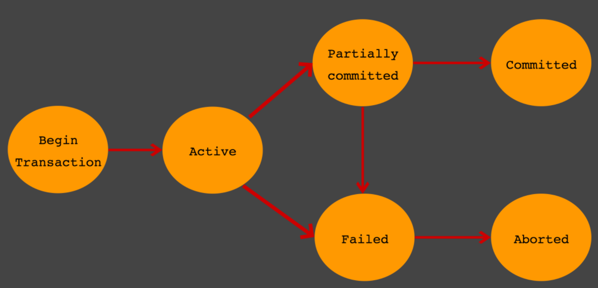

# Part 1-5 Database

* [데이터베이스](#1-데이터베이스)
  * 데이터베이스를 사용하는 이유
  * 데이터베이스 성능
* [Index](#2-index)
  * Index 란 무엇인가
  * Index의 자료구조
    * B+- Tree
    * Hash
    * B+- Tree 사용하는 이유
  * Clustered Index
  * Composite index
  * 고려사항
* [정규화](#3-정규화)
  * 정규화란?
    * 함수적 종속성이란?
    * 조건
  * 종류
    * 제 1정규형
    * 제 2정규형
    * 제 3정규형
    * BCNF
  * 장점
  * 단점
* [반정규화](#4-반정규화)
  * 대상
  * 단점

* [Transaction](#transaction)
  * 트랜잭션(Transaction)이란 무엇인가?
  * 트랜잭션과 Lock
  * 트랜잭션의 특성
  * 트랜잭션을 사용할 때 주의할 점
* [교착상태](#교착상태)
  * 교착상태란 무엇인가
  * 교착상태의 예(MySQL)
  * 교착 상태의 빈도를 낮추는 방법
* [Statement vs PreparedStatement](#statement-vs-preparedstatement)
* [NoSQL](#nosql)
  * 정의
  * CAP 이론
    * 일관성
    * 가용성
    * 네트워크 분할 허용성
  * 저장방식에 따른 분류
    * Key-Value Model
    * Document Model
    * Column Model

[뒤로](https://github.com/YG-creator/Interview_Question_for_Beginner)

</br>

## 1. 데이터베이스

### 데이터베이스를 사용하는 이유

1. **독립성**

   물리적 독립성 : DB 변경시 응용프로그램 변경안해도 됨

   논리적 독립성 : 논리적 구조로 다양한 응용프로그램의 요구 만족

2. **무결성**

   유효성 검사 ->  잘못된 데이터 방지

3. **보안성**

   인가된 사용자만 접근가능하게 함

4. **일관성**

   논리적 구조로 관리 -> 일부 데이터만 변경시 불일치성 배제

5. **중복 최소화**

   데이터 통합해서 관리

</br>

### 데이터베이스의 성능?

* DB 성능은 디스크 헤더의 위치 이동 없이 얼마나 많은 데이터를 한 번에 기록하느냐에 따라 결정된다.

* 그래서 순차적 I/O가 랜덤 I/O 보다 더 빠름

* 하지만 현실에서는 대부분 랜덤 I/O

* 쿼리 튜닝을 통해 랜덤 I/O -> 순차 I/O 해줘야 됨

</br>

[뒤로](https://github.com/YG-creator/Interview_Question_for_Beginner)/[위로](#part-1-5-database)

</br>

## 2. Index

### Index란 무엇인가?

* key(레코드가 저장된 주소) : value(칼럼의 값) -> SLELECT 빨라짐
* INSERT, DELETE, UPDATE 시 쿼리문 실행속도가 느려짐

</br>

### Index 자료구조

그렇다면 DBMS 는 인덱스를 어떻게 관리하고 있는가

#### B+-Tree 인덱스 알고리즘

* 원래의 값을 이용해 인덱싱

* 부등호 연산 가능
* Hash 보다는 느림

#### Hash 인덱스 알고리즘

* 원래의 값이 아닌 해시 값을 이용해 인덱싱
* 부등호 연산 불가능

* 시간복잡도 O(1)

#### 왜 index 를 생성하는데 b-tree 를 사용하는가?

* 부등호 연산이 가능해서

</br>

### Clustered Index

프라이머리 키 값이 비슷한 레코드끼리 묶어서 저장하는 것

테이블당 하나만 생성 가능(프라이커리 키 사용해서)

</br>

### Composite Index

속성 여러개를 Index로 설정가능

</br>

### 고려사항

* 모든 속성에 INDEX를 생성해두면 안좋음
  * INSERT : 데이터 추가됨
  * DELETE : 데이터 그대로임(안쓴다는 표시만 함)
  * UPDATE : INSERT + DELETE

* 컬럼값 종류가 많은 속성을 Index로 설정하는것이 효율적

</br>

[뒤로](https://github.com/YG-creator/Interview_Question_for_Beginner)/[위로](#part-1-5-database)

</br>

## 3. 정규화에 대해서

### 정규화란?

* 데이터 중복으로 인한 이상현상 방지(삽입,삭제,수정)
* 나쁜 릴레이션의 애트리뷰트들을 나누어서 **좋은** 작은 릴레이션으로 분해하는 작업 

</br>

#### 함수적 종속성이란?

속성 X 가 속성 Y를 결정한다 

#### 조건

1.  분해의 대상인 분해 집합 D 는 **무손실 조인** 을 보장해야 한다.
2.  분해 집합 D 는 함수적 종속성을 보존해야 한다.

</br>


### 종류

#### 제 1 정규형

튜플은 도메인에 속하는 하나의 원자값만을 가져야 한다.

#### 제 2 정규형

앞 정규형 + 부분적 종속 제거(X->Y(1개) 이여야 됨)

#### 제 3 정규형

앞 정규형 + 이행적 종속 제거(X->Y->Z 를 X-> Y 와  Y->Z로 나누기)

#### BCNF(Boyce-Codd) 정규형

앞 정규형 + 후보키 일부를 분해

</br>

### 장점

1.  DB 변경 시 이상현상 제거
2.  DB 구조 확장 시 디자인 최소화
3.  데이터 모델이 현실세계 개념들을 반영함
4.  중복 속성을 제거해서 데이터 용량 최소화 가능

</br>

### 단점

* JOIN 연산이 많아져서 성능 저하될수 있음
* 반정규화로 해결가능

</br>

[뒤로](https://github.com/YG-creator/Interview_Question_for_Beginner)/[위로](#part-1-5-database)

</br>

## 4. 반정규화

* 정규화 단점인 JOIN 연산이 많아져서 성능이 저하되는 것을 방지

### 대상

1.  테이블에 자주 사용 &&  일정범위만 조회하는 경우
2.  테이블에 대량 데이터 && 대량의 범위 자주 처리하는 경우

3.  조인연산 많은 경우 

### 단점

1. 무결성 깨질수 있음
2. 입력, 수정, 삭제의 응답 시간이 느려질 수 있음

</br>

[뒤로](https://github.com/YG-creator/Interview_Question_for_Beginner)/[위로](#part-1-5-database)

</br>

## 5. Transaction

### 트랜잭션(Transaction)이란?

* 논리적인 작업 셋을 모두 완벽하게 처리하지 못할 경우에는 원 상태로 복구해서 작업의 일부만 적용되는 현상이 발생하지 않게 만들어주는 기능
* 사용자 입장에서는 작업의 논리적 단위
* 시스템 입장에서는 데이터들을 접근 또는 변경하는 프로그램의 단위

</br>

### 트랜잭션과 vs Lock

1. 트랜잭션 : 완전성 보장

2. Lock : 동시성 제어

</br>

### 특징 ACID

1. 원자성(Automicity)

   중간에 문제가 발생하면 rollback

2. 일관성(Consistency)

   트랜잭션이 완료된 후에도 데이터 일관성 보장

3. 고립성(Isolation)

   트랜잭션 끼리 독립적

4. 지속성(Durablility)

​		트랜잭션 완료 후 commit

</br>

### 상태



* Active

  트랜잭션 실행 중

* Failed

  트랜잭션 실패 더이상 진행 불가

* Partially Committed

  sql문 실행 후 commit만 남은 상태

* Committed

  commit 완료

* Aborted

  트랜잭션 취소 후 rollback

### 주의점

1. 트랜잭션의 범위를 최소화 하자

2. 교착상태

### 교착상태


#### 교착상태란?

서로 소유한 자원을 기다려서 무한히 기다리는 상태 

#### 교착상태의 예(MySQL)

MySQL [MVCC](https://en.wikipedia.org/wiki/Multiversion_concurrency_control)에 따른 특성 때문에 트랜잭션에서 갱신 연산(Insert, Update, Delete)를 실행하면 잠금을 획득한다. (기본은 행에 대한 잠금)

트랜잭션 1이 테이블 B의 첫번째 행의 잠금을 얻고 트랜잭션 2도 테이블 A의 첫번째 행의 잠금을 얻었다고 하자.
```SQL
Transaction 1> create table B (i1 int not null primary key) engine = innodb;
Transaction 2> create table A (i1 int not null primary key) engine = innodb;

Transaction 1> start transaction; insert into B values(1);
Transaction 2> start transaction; insert into A values(1);
```

트랜잭션을 commit 하지 않은채 서로의 첫번째 행에 대한 잠금을 요청하면


```SQL
Transaction 1> insert into A values(1);
Transaction 2> insert into B values(1);
ERROR 1213 (40001): Deadlock found when trying to get lock; try restarting transaction
```

Deadlock 이 발생한다. 일반적인 DBMS는 교착상태를 독자적으로 검출해 보고한다.

#### 교착 상태의 빈도를 낮추는 방법
* 자주 커밋한다.
* 정해진 순서로 테이블에 접근한다.
* 읽기 잠금 획득 (SELECT ~ FOR UPDATE)의 사용을 피한다.
* 한 테이블의 복수 행을 복수의 연결에서 순서 없이 갱신하면 교착상태가 발생하기 쉽다, 이 경우에는 테이블 단위의 잠금을 획득해 갱신을 직렬화 하면 동시성을 떨어지지만 교착상태를 회피할 수 있다.</br>

[뒤로](https://github.com/YG-creator/Interview_Question_for_Beginner)/[위로](#part-1-5-database)

</br>

## 6. Statement vs PreparedStatement

| PreparedStatement                                | Statement                                             |
| ------------------------------------------------ | ----------------------------------------------------- |
| 쿼리 자체에 조건이 들어가는 dynamic sql 사용     | 변수를 설정하고 바인딩하는 static sql 사용            |
| 쿼리 수행하기 전에 쿼리가 컴파일 되어있어서 빠름 | 쿼리 수행하기 전에 쿼리가 컴파일 되어있지 않아서 느림 |

* PreparedStatement가 빠르므로 사용 권장

[뒤로](https://github.com/YG-creator/Interview_Question_for_Beginner)/[위로](#part-1-5-database)

</br>

## 7. NoSQL

### 정의

관계형 데이터 모델을 **지양** 하며 대량의 분산된 데이터를 저장하고 조회하는 데 특화되었으며 스키마 없이 사용 가능하거나 느슨한 스키마를 제공하는 저장소를 말한다.

종류마다 쓰기/읽기 성능 특화, 2 차 인덱스 지원, 오토 샤딩 지원 같은 고유한 특징을 가진다. 대량의 데이터를 빠르게 처리하기 위해 메모리에 임시 저장하고 응답하는 등의 방법을 사용한다. 동적인 스케일 아웃을 지원하기도 하며, 가용성을 위하여 데이터 복제 등의 방법으로 관계형 데이터베이스가 제공하지 못하는 성능과 특징을 제공한다.

</br>

### CAP 이론

1. 일관성(Consistency)

   다중 클라이언트에서 같은 시간에 조회하는 데이터는 항상 동일한 데이터임을 보증

2. 가용성(Availability)

   모든 클라이언트에서 고장이 나도 읽기와 쓰기 요청에 대하여 항상 응답이 가능

3. 네트워크 분할 허용성(Partition)

   네트워크가 단절되거나 네트워크 데이터의 유실이 일어나더라도 각 지역 내의 시스템은 정상적으로 동작해야 함

</br>

### 저장 방식에 따른 NoSQL 분류

1. Key-Value(키-값)

   * 복잡한 조회 연산을 지원하지 않는다

   * 고속 읽기와 쓰기에 최적화

   * 하나의 서비스 요청에 다수의 데이터 조회 및 수정 연산이 발생하면 트랜잭션 처리가 불가능

   ex) Redis

2. Document(키(ID) - 값)

   * 논리적인 데이터 저장과 조회 방법이 관계형 데이터베이스와 유사

   * 문서 저장과 동시에 문서 ID 에 대한 인덱스를 생성

   * 대부분 2 차 인덱스를 생성

   * B 트리는 읽기와 쓰기의 비율이 7:3 정도일 때 가장 좋은 성능

   * 중앙 집중식 로그 저장, 타임라인 저장, 통계 정보 저장 등에 사용

   ex) MongoDB

3. Column

   * 하나의 키에 여러 개의 컬럼 이름과 컬럼 값

   * 모든 컬럼은 항상 타임 스탬프 값과 함께 저장

   * 쓰기에 더 특화 

   * 커밋로그와 메모리에 저장한 후 응답하기 때문에 빠른 응답속도를 제공

   * 채팅 내용 저장, 실시간 분석을 위한 데이터 저장소 등의 서비스 구현에 적합

</br>

[뒤로](https://github.com/YG-creator/Interview_Question_for_Beginner)/[위로](#part-1-5-database)

</br>

_Database.end_
