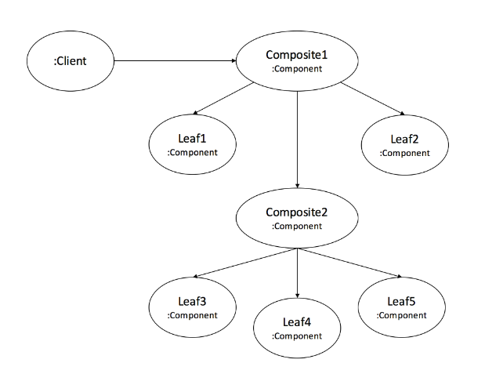
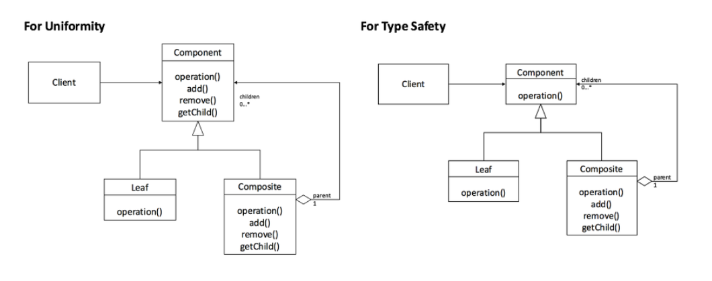

# Part 1-6 디자인 패턴

* [디자인 패턴이란?](#1-디자인-패턴이란?)
* [구조](#2-구조)
* [분류](3-분류)
  * 생성 패턴
  * 구조 패턴
  * 행위 패턴
* [디자인 원칙](#4-디자인-원칙)
  * Design smells
  * SOLID
* [종류](5-종류)
  * Adapter Pattern
  * Composite Pattern
  * Factory Method Pattern
  * Template Method Pattern
  * Observer Pattern
  * Singleton Pattern
  * Strategy Pattern

# 1. 디자인 패턴이란?

재사용성, 호환성, 유지 보수성을 보장하는 소프트웨어 설계 패턴


# 2. 구조

1. Context 

   문제 상황

2. Problem

   해결될 필요가 있는 디자인 이슈들

3. Solution

   문제 해결을 위한 요소, 요소간 관계, 책임, 협력관계

   다양한 상황에 적용할수 있는 템플릿

​	

# 3. 분류


## 1. 생성 패턴

* 객체 생성에 관련된 패턴

  특정 객체 생성 or 변경 -> 프로그램 구조에 큰 영향 ㄴㄴ


## 2. 구조 패턴

* 클래스나 객체를 조합해 더 큰 구조 만드는 패턴

  2개의 객체를 묶어 단일 인터페이스로 제공

  2개의 객체를 묶어 새로운 기능 제공


## 3. 행위 패턴

* 객체의 행위를 조직, 관리, 연합

  책임 분배, 결합도 최소화


# 4. 디자인 원칙(SOLID)

## 1. Design smells

나쁜 디자인 증상 4가지

1. Rigidity(경직성) 

   하나의 변경을 위해서 다른 것들을 변경해야 됨

2. Fragility (취약성)

   어떤 부분을 수정하였는데 관련이 없는 다른 부분에 영향을 준다.

3. Immobility(부동성)

   재사용하기 위해서 시스템을 분리해서 컴포넌트를 만드는게 어렵다.

4. Viscosity(점착성)

   시스템에 코드를 추가하는 것보다 핵을 추가하는 것이 더 쉽다.

 

## 2. SOLID

소프트웨어 디자인 원칙

1. Single Responsibility Principle

   하나의 클래스는 하나의 역할만 해야 함

2. Open Closed Principle

   확장에 열려있고, 주변의 수정에는 닫혀 있어야 한다.

3. Liskov Substitution Principle(LSP)

   자식이 부모의 자리에 항상 교체될 수 있어야 함

4. Interface Segregation Principle(ISP)

   인터페이스가 잘 분리되어서, 클래스가 꼭 필요한 인터페이스만 구현하도록 해야함

5. Dependency Inversion Principle(DIP)

   상위 모듈이 하위 모듈에 의존하면 안됨

   둘 다 추상화에 의존하며, 추사오하는 세부 사항에 의존하면 안됨


# 5. 종류

## 1. Adapter Pattern

어뎁터 class로 서로다른 interface끼리 변환없이 서로 사용가능


## 2. Composite Pattern

객체를 트리처럼 다룰 수 있음





안전성을 위해서 add, remove는 composite에서만 가능하게 함


## 3. Factory Method Pattern

객체를 만드는 부분을 Sub class에 맡기는 패턴

ex)

- RobotFactory 클래스 생성

```java
public abstract class RobotFactory {
	abstract Robot createRobot(String name);
}
```

- SuperRobotFactory 클래스 생성

```java
public class SuperRobotFactory extends RobotFactory {
	@Override
	Robot createRobot(String name) {
		switch(name) {
		case "super" :
			return new SuperRobot();
		case "power" :
			return new PowerRobot();
		}
		return null;
	}
}
```

생성하는 클래스를 따로 만듬...

그 클래스는 factory 클래스를 상속하고 있기 때문에, 반드시 createRobot을 선언해야 함.

name으로 건너오는 값에 따라서, 생성되는 Robot이 다르게 설계됨.


## 4. Template Method Pattern

추상클래스 + 구현 클래스

1. 추상클래스 : 변해서는 안되는 핵심 로직 선언 + abstract로 핵심로직내 함수를 확장가능하게 함
2. 구현클래스 : 추상클래스 상속 받아서 직접 구현\

추상클래스가 너무 많으면 관계가 복잡해짐


## 5. Observer pattern

한 객체의 상태가 바뀌면 그 객체에 의존하는 다른 객체들에게 연락이 가고, 자동으로 정보가 갱신되는 1:N 관계(혹은 1대1)를 정의한다.


## 6. Singleton pattern

하나의 인스턴스만 생성하여 사용하는 디자인 패턴이다.

* Initialization on demand holder idiom (holder에 의한 초기화)

```java
public class Something {
    private Something() {
    }
 
    private static class LazyHolder {
        public static final Something INSTANCE = new Something();
    }
 
    public static Something getInstance() {
        return LazyHolder.INSTANCE;
    }
}
```

싱글톤의 초기화 문제에 대한 책임을 JVM에게 떠넘기는 걸 활용

static : 클래스 로딩시점에서 한번만 호출

final : 다시 값이 할당되지 않도록


## 7. Strategy Pattern

로직을 독립적으로 관리하는 것이 편해진다. 로직에 들어가는 '행동'을 클래스로 선언하고, 인터페이스와 연결하는 방식으로 구성하는 것!

```
[ 슈팅 게임을 설계하시오 ]
유닛 종류 : 전투기, 헬리콥터
유닛들은 미사일을 발사할 수 있다.
전투기는 직선 미사일을, 헬리콥터는 유도 미사일을 발사한다.
필살기로는 폭탄이 있는데, 전투기에는 있고 헬리콥터에는 없다.
```


- ##### 미사일을 쏘는 것과 폭탄을 사용하는 것을 캡슐화하자

  ShootAction과 BombAction으로 인터페이스를 선언하고, 각자 필요한 로직을 클래스로 만들어 implement한다.

- ##### 전투기와 헬리콥터를 묶을 Unit 추상 클래스를 만들자

  Unit에는 공통적으로 사용되는 메서드들이 들어있고, 미사일과 폭탄을 선언하기 위해 variable로 인터페이스들을 선언한다.

```java
class Fighter extends Unit {
    private ShootAction shootAction;
    private BombAction bombAction;
    
    public Fighter() {
        shootAction = new OneWayMissle();
        bombAction = new SpreadBomb();
    }
}
```

`Fighter.doAttack()`을 호출하면, OneWayMissle의 attack()이 호출될 것이다.