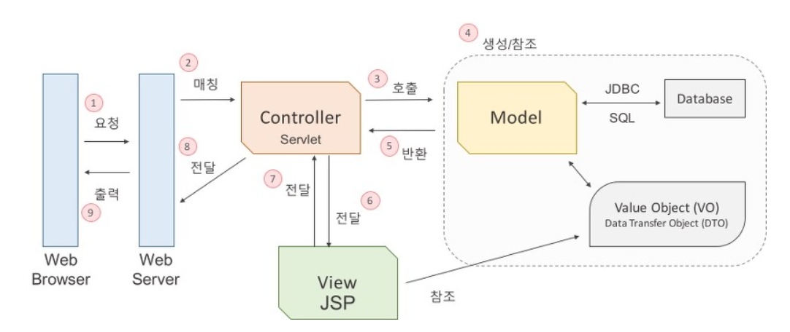

# Part 1-1 개발 CS

* [좋은 코드](#1-좋은-코드란?)
* [객체 지향 프로그래밍](#2-객체지향-프로그래밍)
  * 객체 지향 개발 원칙은 무엇인가?
* [RESTful API](#3-RESTful-API)
* [TDD](#4-TDD)
* [함수형 프로그래밍](#5-함수형-프로그래밍)
* [MVC](#6-MVC)
* [Git](#7-git)

 

# 1. 좋은 코드

- 읽기 쉬운 코드
- 중복이 없는 코드
- 테스트가 용이한 코드

# 2. 객체지향 프로그래밍

1. 개념

   * 객체 : 현실 세계의 사물들

   * 추상화 : 객체의 특징을 뽑아와 프로그래밍하는 것

2. 장점
   * 재사용성
   * 디버깅 쉬움
   * 유지보수 용이
   * 매핑 수월 -> 요구사항 파악 명확

3. 단점
   * 예측할 수 없는 상태 갖게 됨 -> 내부에서 버그 발생 가능
4. 설계원칙(SOLID)
   1. SRP(Single Responsibility Principle) : 단일 책임 원칙
      클래스는 단 하나의 책임을 가져야 하며 클래스를 변경하는 이유는 단 하나의 이유이어야 한다.
   2. OCP(Open-Closed Principle) : 개방-폐쇄 원칙
      확장에는 열려 있어야 하고 변경에는 닫혀 있어야 한다.
   3. LSP(Liskov Substitution Principle) : 리스코프 치환 원칙
      상위 타입의 객체를 하위 타입의 객체로 치환해도 상위 타입을 사용하는 프로그램은 정상적으로 동작해야 한다.
   4. ISP(Interface Segregation Principle) : 인터페이스 분리 원칙
      인터페이스는 그 인터페이스를 사용하는 클라이언트를 기준으로 분리해야 한다.
   5. DIP(Dependency Inversion Principle) : 의존 역전 원칙
      고수준 모듈은 저수준 모듈의 구현에 의존해서는 안된다.

# 3. RESTful API

1. RESTful API란?

   * API 중심에 자원이 있고 HTTP Method를 통해 자원을 처리하도록 설계하는 것
     * **리소스** 와 **행위** 를 명시적이고 직관적으로 분리한다.
     * Message 는 Header 와 Body 를 명확하게 분리해서 사용한다.
     * API 버전을 관리한다.
     * 서버와 클라이언트가 같은 방식을 사용해서 요청하도록 한다.
   
2. 장점

   * Open API 를 제공하기 쉽다.

   * 멀티플랫폼 지원 및 연동이 용이하다.

   * 원하는 타입으로 데이터를 주고 받을 수 있다.

   * 기존 웹 인프라(HTTP)를 그대로 사용할 수 있다.

3. 단점

   * 사용할 수 있는 메소드가 4 가지 밖에 없다.

   * 분산환경에는 부적합하다.

   * HTTP 통신 모델에 대해서만 지원한다.

4. REST 6가지 원칙
   * Uniform Interface
   * Stateless
   * Caching
   * Client-Server
   * Hierarchical system
   * Code on demand  
     

# 4. TDD

1. 개념

   요구되는 새로운 기능에 대한 자동화된 테스트케이스를 작성하고 해당 테스트를 통과하는 가장 간단한 코드를 작성한다. 

2. 하는거

   * 요구사항 분석 -> 테스트 케이스 작성

   * 새로운 기능 추가할 때 테스트 코드 작성

   * Refactor(TDD를 위해 여러 함수로 나누기)

     

3. 단점

   * 생산성이 좋지는 않음

   * 높은 진입장벽

   * 주객전도 될수도 있음

# 5. 함수형 프로그래밍

1. 특징

   1. immutable

      * 객체는 객체가 가지고 있는 값을 변경할 수 없다.

      * 변경하려면 새로운 객체를 생성해야됨

   2. first class citizen으로서의 function

      * 변수나 데이터 구조안에 함수를 담을 수 있어서 함수의 파라미터로 전달할 수 있고, 함수의 반환값으로 사용할 수 있다.

      * 할당에 사용된 이름과 관계없이 고유한 구별이 가능하다.

      * 함수를 리터럴로 바로 정의할 수 있다.

# 6. MVC

1. 개념

   * Model + View + Controller

     1. Model 
        * 데이터 처리(비즈니스 로직)

     2. View  
        * 화면에 출력(모델 결과값)
     3. Controller 
        * 매핑(요청에 따른 모델 호출)
        * 데이터 전달(모델, 뷰)

2. 구동 원리

​		*C/S(Client - Server)구조로 요청을 하면 그에 맞는 응답을 하는 구조를 기본으로 하고 있다.*

1. 웹 브라우저가 웹 서버에 웹 애플리케이션 실행을 요청한다. (MVC 구조가 WAS라고 보면 된다.)

2. 웹 서버는 들어온 요청을 처리할 수 있는 서블릿을 찾아서 요청을 전달한다.(Matching)

3. 서블릿은 모델 자바 객체의 메서드를 호출한다.

4. 데이터를 가공하여 값 객체를 생성하거나, JDBC를 사용하여 데이터베이스와의 인터랙션을 통해 값 객체를 생성한다.

5. 업무 수행을 마친 결과값을 컨트롤러에게 반환한다.

6. 컨트롤러는 모델로부터 받은 결과값을 View에게 전달한다.

7. JSP는 전달받은 값을 참조하여 출력할 결과 화면을 만들고 컨트롤러에게 전달한다.

8. 뷰로부터 받은 화면을 웹 서버에게 전달한다.

9. 웹 브라우저는 웹 서버로부터 요청한 결과값을 응답받으면 그 값을 화면에 출력한다.

# 7. Git

1. 개념
   * 분산버전관리시스템
   
2. 특징
   * 버전 공유
   * 파일 시스템의 스냅샷을 저장
   
3. Git flow 전략

   1. Git flow

      

      1. 개념

         Vincent Driessen이 말한 branching model를 구현한 Git 확장 모듈

      2. 사용처

         계획적인 릴리즈를 가지고 스케줄이 짜여진 대규모 프로젝트에 사용

      3. 기본 5가지 branch

         1. Master : 릴리즈 시 사용하는 최종 단계 메인 branch
            * Tag를 통해 버전 관리를 한다.
   
         2. Develop : 다음 릴리즈 버전 개발을 진행하는 branch
   
            * 추가기능 필요시 featur branch 내어 개발 진행
   
            * 추가기능 완료시 develop branch에 merge함
   
         3. Feature : 새로운 기능 구현하는 branch
   
            * from develop /  to develop
            * merge할 때는 --no-ff 옵션으로 merge(머지가 되었음을 git에 남김)
            * 기능 단위마다 branch 생성
   
         4. Release : master branch에 merge시 bug fix하는 branch

            * from develop / to develop,master

            * 릴리즈 준비되면 master에 merge( --no-ff 옵션으로 merge(머지가 되었음을 git에 남김))

            * master에 merge 한 후 
              * tag 명령을 사용하여 릴리즈 버전 명시 / -s나 -u <key> 옵션을 이용하여 머지한 사람의 정보 남김
              *  develop에 merge

         5. hotfix : master branch의 bug fix 

            * from master / to develop,master

            * master 버그 수정 후
              * develop에 반영
              * master에 반영(tag 추가)
              * release가 있다면 merge
   
      3. 장점
   
         * 명령어가 나와있다.
   
         * 웬만한 에디터와 IDE에는 플러그인으로 존재한다.
   
      4. 단점
   
         * branch가 많아 복잡하다.
   
         * 안 쓰는 branch가 있다. 그리고 몇몇 branch는 애매한 포지션이다.
   
   2. GitHub flow
   
      1. 개념
   
         Git flow 단순화 한거(release, hotfix 없앰)
   
         자동화
   
      2. 사용처
   
         일반 프로젝트에 사용
   
      2. 사용법
   
         1. `master` branch는 어떤 때든 배포가 가능하다.
            * `master` branch는 항상 최신의 상태
            * stable 상태로 Product에 배포되는 branch
   
         2. branch 이름 이름은 어떤 일을 하는지 명확하게 작성
   
            `feature` branch나 `develop` branch가 존재하지 않아서 명확하게 써줘야됨
   
         3. 원격지 branch로 수시로 push를 한다.
   
            원하는 시점으로 roll back 가능
   
         4. pull request 시점
   
            * 피드백 필요할 때
   
            * merging 준비 완료
   
         5. 기능에 대한 리뷰, 시안 후 master로 merge한다
   
         6. `master`로 머지되고 푸시되었을 때는 즉시 배포(자동 배포)되어야 한다.
   
            `master`로 머지가 일어나면 `hubot`을 이용하여 자동으로 배포가 되도록 설정
   
      3. 장점
         - branch 전략이 단순하다.
         - Github 사이트에서 제공하는 기능 사용
         - 코드 리뷰 가능
         - CI
           - 형상관리 항목에 대한 선정과 형상관리 구성 방식 결정
           - 빌드/배포 자동화 방식
           - 단위테스트/통합테스트 방식
         
      4. 단점
         - CI와 배포 자동화가 되어있지 않은 시스템에서는 사람이 관련된 업무를 진행한다.
         - 복잡한 대규모 프로젝트에는 부적절
         - 배포 자동화 -> 배포, 환경 구성, 릴리즈, 통합에 대한 이슈
   
      
   
   3. GitLab flow
   
      
   
      1. branch
   
         1. Production
            * Git flow의 Master branch역할
            * 배포 역할만 담당
            * master 이상 권한만 push 가능
         2. Pre-Production
            * 배포 시기 조절가능
            * production 브랜치로 결과를 넘기기 전에 테스트를 수행
         3. Master
            * 기능 추가를 위해 새로운 브랜치 생성
            * 새로운 branch에 완료 후 merge request
            * review 후 master에 merge
            * 테스트가 필요하다면 pre-production에서 테스트
      
         
      
      2. 장점
      
         * Git 단점 보완(배포시기 조절 가능)
         * Production브랜치에서 릴리즈된 코드가 항상 프로젝트의 최신버전 상태를 유지해야할 필요가 없다
      
      
      
      

[뒤로](https://github.com/YG-creator/Interview_Question_for_Beginner)/[위로](#Part-1-1-개발-CS)

 

 

Ref : https://github.com/JaeYeopHan/Interview_Question_for_Beginner/tree/master/Development_common_sense

_Development_common_sense.end_

