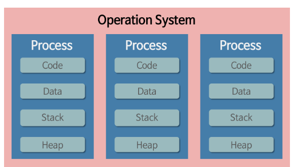

# Part 1-4 운영체제

* [1. 프로세스 vs 스레드](#1.-프로세스-vs-스레드)
  * 프로그램
  * 프로세스
  * 스레드
* [2. 멀티프로세스 vs 멀티스레드](#2.-멀티프로세스-vs-멀티스레드)
  * 멀티프로세스
  * 멀티스레드
  * 차이점
* [3. 스케줄러](#3.-스케줄러)
  * Queue
  * 스케줄러
    * 단기
    * 중기
    * 장기
* [4. 동기 vs 비동기](#4.-동기-vs-비동기)
* [5. 프로세스 동기화](#5.-프로세스-동기화)
  * Critical Section
  * 문제점
  * 해결책
    * Lock
    * Semaphores
    * 모니터
* [6. 메모리 관리 전략](#6.-메모리-관리-전략)
  * Swapping
  * Paging
  * Segmentation
  * 가상메모리
    * 요구 페이징
    * 페이지 교체 알고리즘
* [7. 캐시](#7.-캐시)
  * 캐시
  * 캐시 성능
  * 캐시의 지역성 원리
  * Caching line

[뒤로](https://github.com/YG-creator/Interview_Question_for_Beginner)

 

# 1. 프로세스 vs 스레드

## 프로그램

어떤 작업을 위해 실행할 수 있는 파일

## 프로세스

1. 개념
   * 컴퓨터에서 연속적으로 실행되고 있는 컴퓨터 프로그램
   * 디스크로부터 메모리에 적재되어 CPU의 할당을 받을 수 있는 것
2. 할당받는 시스템 자원
   * CPU 사용시간
   * 운영되기 위해 필요한 주소 공간
   * 독립된 메모리 영역(Code, Data, Stack, Heap)
     * stack : 임시저장장소(함수 매개변수, 반환변수, 로컬변수)
     * Heap : 전역변수

3. 특징
   * 한 프로세스는 다른프로세스에 접근하기 위해서는 IPC(파이프, 파일 ,소켓등을 이용한 통신방법) 필요

4. PCB

   1. 개념

      * 프로세스에 대한 중요한 정보 저장

      * 프로세스 생성시 생성됨

      * 프로세스 전환시 필요한 저장 및 불러오기 기능

   2. 저장되는 정보

      * 프로세스 ID : 프로세스 식별번호
      * 프로세스 상태(new, ready, running, waiting, terminated)

      * 프로그램 카운터 : 다음에 실행할 명령어의 주소

      * CPU 레지스터 

      * CPU 스케쥴링 정보 : 프로세스의 우선순위, 스케줄 큐에 대한 포인터 등

      * 메모리 관련 정보 : 페이지 테이블 or 세그먼트 테이블과 같은 정보

      * 입출력 상태 정보 : 프로세스에 할당된 입출력 장치들과 열린파일 목록

      * 어카운팅 정보 : 사용된 CPU 시간, 시간제한, 계정번호 등

## 쓰레드

1. 개념

   프로세스 내에서 실행되는 여러 흐름의 단위

2. 특징

   1. 프로세스 내 Code, Data, Heap 공유

   2. 독립적 할당

      * 스택

        함수는 독립적인 호출이 가능하다 -> 독립적인 실행 흐름을 추가하기 위해서 스택은 공유안하고 독립적으로 할당함

      * 레지스터 집합

        스케줄러에 의해서 명령어가 연속적으로 수행되지 못하고 어느 부분까지 수행했는지 기억할 필요가 있어서 돌깁적으로 할당함

[뒤로](https://github.com/YG-creator/Interview_Question_for_Beginner)/[위로](#part-1-4-운영체제)

 

# 2. 멀티프로세스 vs 멀티스레드

## 멀티 프로세스

1. 개념

하나의 응용프로그램을 여러 개의 프로세스로 구성하여 각 프로세스가 하나의 작업(태스크)을 처리하도록 하는 것이다.
프로그램 여러개 키는거

2. 장점

* 여러 개의 자식 프로세스 중 하나에 문제가 발생하면 그 자식 프로세스만 죽는 것 이상으로 다른 영향이 확산되지 않는다.

3. 단점

* Context Switching에서의 오버헤드

* 복잡한 프로세스간 통신(IPC)

  

## 멀티 쓰레드

1. 개념

하나의 응용프로그램을 여러 개의 스레드로 구성하고 각 스레드로 하여금 하나의 작업을 처리하도록 하는 것이다.

하나의 프로그램으로 여러 작업 처리

2. 장점

* 자원의 효율성 증대 (자원 할당과정 감소)

* 시스템 처리량 증가(자원 공유, context switching 작업량이 작음)

* 응답시간 단축(메모리 공유)

  

3. 단점

* 디버깅이 까다로움
* 단일 프로세스의 경우 효과가 미비
* 다른 프로세스에서 제어 못함
* 동기화 문제(공유해서)
* 하나 프로세스 잘못되면 전체가 영향끼침

 

## 차이점

| 멀티프로세스                              | 멀티스레드                         |
| ----------------------------------------- | ---------------------------------- |
| 많은 메모리 공간과 CPU 시간을 차지        | 적은 메모리 공간을 차지            |
| context switching이 많음                  | context switching이 적음           |
| 하나의 오류가 전체에 영향을 미치지 않음   | 하나의 오류가 전체에 영향을 미침   |
| 코드, 데이터, 힙 독립적 -> 동기화 문제 ㄴ | 코드,데이터,힙 공유 -> 동기화 문제 |

[뒤로](https://github.com/YG-creator/Interview_Question_for_Beginner)/[위로](#part-1-4-운영체제)

 

# 3. 스케줄러

## Queue

1. 개념 

   프로세스들을 넣고 빼는 곳

2. 종류

   1. Job Queue : 현재 시스템 내에 있는 모든 프로세스의 집합

   2. Ready Queue : 현재 메모리 내에 있으면서 CPU 를 잡아서 실행되기를 기다리는 프로세스의 집합

   3. Device Queue : Device I/O 작업을 대기하고 있는 프로세스의 집합

      

## 스케줄러

1. 개념

   Queue에 프로세스들을 넣고 빼주는 역할

2. 종류

   1. 장기스케줄러(Long-term scheduler or job scheduler)

      * too many 프로세스 -> Disk에 임시저장(new) -> 장기스케줄러 -> 일부 메모리 할당(ready)
      * 한번에 너무 많거나 적게 프로세스에 메모리 할당하면 성능저하

   2. 단기스케줄러(Short-term scheduler or CPU scheduler)

      * 메모리(ready) -> 단기스케줄러 -> CPU 할당(running)

      * 종류

        * FCFS

          * 먼저 온 순서대로 처리

          * 앞 프로세스가 오래걸리면 효율성이 떨어짐(convoy effect)

          * 비선점형(못뺏음)

            

          ## SJF

          * CPU burst time이 짧은 프로세스부터 처리

          * 효율성은 좋지만 긴 프로세스는 영원히 처리 못할 수도 있음

          * 비선점형

            

          ## SRTF

          * 처리중인 프로세스 남은 시간 > 새로운 프로세스 처리 시간  -> 새로운 프로세스 처리
          * 프로세스 처리 완료시간을 예측할 수 없음
          * 선점형(뺏을 수 있음)

          

          ## Priority Scheduling

          * 우선순위가 높은거 부터 처리(숫자가 낮을수록 우선순위 높음)

          * 선점형 : 실행중인것보다 높은게 오면 뺏기

          * 비선점형 : Ready Queue의 Head에 넣기

          * 실행준비는 되어도 CPU를 무기한 대기할 수도 있음 

            

          ## Round Robin

          * 프로세스마다 동일한 시간동안 CPU를 할당함
          * 시간이 지나면 ready queue 맨뒤에 줄섬
          * CPU 사용시간이 랜덤한 프로세스들이 섞여있을 때 효율적
          * context save가ㄴ으해서 RR 가능해짐
          * 적절한 할당시간(time quantum)이 중요
            * 할당시간이 너무 커지면 FCFS와 같아짐
            * 할당 시간이 너무 적으면 context switch로 overhead 발생

   3. 중기스케줄러(Medium-term scheduler or Swapper)

      * 메모리(ready) -> 중기스케줄러 -> 다 디스크로 쫓아냄(suspended)

      * blocked vs suspended

        blocked : 다시 ready 상태 될 수 있음

        suspended : 다시 ready 상태 될 수 없음

      

 

[뒤로](https://github.com/YG-creator/Interview_Question_for_Beginner)/[위로](#part-1-4-운영체제)#part-1-4-운영체제)

 

# 4. 동기 VS 비동기

## 동기

* 내가 빨래, 설거지 , 청소하기	- 언제끝나는지 바로앎

* 메소드 실행 -> 바로 값 반환 

  

## 비동기

* 업체에게 맡겨서 빨래,설거지, 청소하기 - 언제끝나는지 모름
* task를 위임해서 바로 반환값이 안나옴

[뒤로](https://github.com/JaeYeopHan/for_beginner)/[위로](#part-1-4-운영체제)

 

---

# 5. 프로세스 동기화

## Critical Section

동일한 자원을 동시에 접근하는 작업을 실행하는 코드 영역

## 문제점

1. 공유 자원을 동시에 사용시 문제가 생김

   ex) Dead Lock : 서로 원하는 자원이 사용중이여서 무기한 대기함

2. Busy Waiting

   Critical Section 에 진입해야하는 프로세스는 진입 코드를 계속 반복 실행해야 하며, CPU 시간을 낭비

## 해결

1. 조건

   * Mutual Exclusion(상호 배제)
     프로세스 P1 이 Critical Section 에서 실행중이라면, 다른 프로세스들은 그들이 가진 Critical Section 에서 실행될 수 없다.
   * Progress(진행)
     Critical Section 에서 실행중인 프로세스가 없고, 별도의 동작이 없는 프로세스들만 Critical Section 진입 후보로서 참여될 수 있다.

   * Bounded Waiting(한정된 대기)
     P1 가 Critical Section 에 진입 신청 후 부터 받아들여질 때가지, 다른 프로세스들이 Critical Section 에 진입하는 횟수는 제한이 있어야 한다.

2. 방법

   1. 1번 문제

      1. Mutex Lock 

         * Critical Section에 하나의 대상만(Process or Thread) 접근 가능하게 함

         * 동시접근 방지위해서 Lock 사용

           사용 -> Lock 획득-> 빠져 나오기 -> Lock 방출

      1. Semaphore
         * critical section에 하나 이상의 대상만(Process or Thread) 접근 가능
         * 종류

           - Counting Semaphore(2개 이상)

           - Binary Semaphore(1개)

      1. Monitor
         - 고급 언어의 설계 구조물로서, 개발자의 코드를 상호배제 하게끔 만든 추상화된 데이터 형태이다.
         - 공유자원에 접근하기 위한 키 획득과 자원 사용 후 해제를 모두 처리한다. (세마포어는 직접 키 해제와 공유자원 접근 처리가 필요하다. )

   2. 2번 문제
      1. Critical Section에 진입 실패한 프로세스는 Block 처리한 후 Critical Section에 자리가 날때마다 깨워서 해결

[뒤로](https://github.com/YG-creator/Interview_Question_for_Beginner)/[위로](#part-1-4-운영체제)

 

# 6. 메모리 관리 전략

## Swapping

프로세스를 보조기억장치로 내보내거나 가져와서 관리

## Paging

* 논리 메모리와 물리 메모리를 연속적으로 저장 안해도됨
* 물리 메모리는 고정된 크기의 Frame 블록으로 분리
* 논리 메모리는 고정된 크기의 Page 블록으로 분리
* Page는 Frame의 남는 곳에 순서 상관없이 배치됨
* 외부단편화 해결
* 내부단편화 문제

## Segmentation

* 물리, 논리 메모리를 서로다른 크기의 블록인 Segment로 분리
* 사용자가 2개의 주소로 지정(세그먼트 번호 + 변위)
* 세그먼트 테이블에는 세그먼트의 시작 물리 주소 + 세그먼트의 길이를 저장
* 내부단편화 해결
* 외부단편화 문제

## 가상메모리

* 개념

  프로세스 전체가 메모리 내에 올라오지 않더라도 실행이 가능하도록 하는 기법

* 장점

  * 물리 메모리보다 큰 프로그램 실행 가능
  * Swapping 횟구 줄어서 실행 속도가 빨라짐
  * 더 많은 프로그램을 동시에 실행할수 있음
  * 프로세스간 페이지 공유

* 사용법

  프로세스가 요구하는 메모리 공간 -> 가상 메모리 -> 필요한 메모리만 실제 물리 메모리에 올림

* 페이지 교체

  페이지 부재시 원하는 페이지를 보조저장장치를 가져옴

  페이지 부재시 모든 물리 메모리가 사용중이면 페이지 교체

  * 방법

    물리 메모리가 모두 사용중인 상황에서의 메모리 교체 흐름이다.

    1.  디스크에서 필요한 페이지의 위치를 찾는다
    1.  빈 페이지 프레임을 찾는다.
        1.  `페이지 교체 알고리즘`을 통해 희생될(victim) 페이지를 고른다.
        1.  희생될 페이지를 디스크에 기록하고, 관련 페이지 테이블을 수정한다.
    1.  새롭게 비워진 페이지 테이블 내 프레임에 새 페이지를 읽어오고, 프레임 테이블을 수정한다.
    1.  사용자 프로세스 재시작

  * 알고리즘

    1. FIFO 페이지 교체

       먼저 물리 메모리에 들어온 페이지 순서대로 페이지 교체됨

       * 장점

         * 이해하기도 쉽고, 프로그램하기도 쉽다.

       * 단점
         * 오래된 페이지가 항상 불필요하지 않은 정보를 포함하지 않을 수 있다(초기 변수 등)
         * 처음부터 활발하게 사용되는 페이지를 교체해서 페이지 부재율을 높이는 부작용을 초래할 수 있다.
         * `Belady의 모순`: 페이지를 저장할 수 있는 페이지 프레임의 갯수를 늘려도 되려 페이지 부재가 더 많이 발생하는 모순이 존재한다.

    2. 최적 페이지 교체(Optimal Page Replacement)

       앞으로 가장 오랫동안 사용되지 않을 페이지를 찾아 교체

       * 장점

         * 알고리즘 중 가장 낮은 페이지 부재율을 보장한다.

       * 단점
         * 구현의 어려움이 있다. 모든 프로세스의 메모리 참조의 계획을 미리 파악할 방법이 없기 때문이다.

    3. LRU 페이지 교체(LRU Page Replacement)

       `LRU: Least-Recently-Used`  
       가장 오랫동안 사용되지 않은 페이지를 선택하여 교체한다.

       * 특징
         * 대체적으로 `FIFO 알고리즘`보다 우수하고, `OPT알고리즘`보다는 그렇지 못한 모습을 보인다.

    4. LFU 페이지 교체(LFU Page Replacement)

       `LFU: Least Frequently Used`  
       참조 횟수가 가장 적은 페이지를 교체하는 방법이다. 

       * 특징
         * 어떤 프로세스가 특정 페이지를 집중적으로 사용하다, 다른 기능을 사용하게되면 더 이상 사용하지 않아도 계속 메모리에 머물게 되어 초기 가정에 어긋나는 시점이 발생할 수 있다
         * 최적(OPT) 페이지 교체를 제대로 근사하지 못하기 때문에, 잘 쓰이지 않는다.

    5. MFU 페이지 교체(MFU Page Replacement)

       `MFU: Most Frequently Used`  
       참조 횟수가 가장 많은 페이지를 교체하는 방법이다. 

       * 특징
         * 최적(OPT) 페이지 교체를 제대로 근사하지 못하기 때문에, 잘 쓰이지 않는다.

### 요구 페이징

가상 메모리 시스템에서 많이 사용된다. 그리고 가상 메모리는 대개 [페이지](#paging페이징)로 관리된다.

프로그램 실행에 필요한 페이지를 물리메모리에 올림

### 페이지 교체 알고리즘

1. FIFO 페이지 교체

   가장 간단한 페이지 교체 알고리즘으로 FIFO(first-in first-out)의 흐름을 가진다. 즉, 먼저 물리 메모리에 들어온 페이지 순서대로 페이지 교체 시점에 먼저 나가게 된다는 것이다.

   * 장점

     * 이해하기도 쉽고, 프로그램하기도 쉽다.

   * 단점
     * 오래된 페이지가 항상 불필요하지 않은 정보를 포함하지 않을 수 있다(초기 변수 등)
     * 처음부터 활발하게 사용되는 페이지를 교체해서 페이지 부재율을 높이는 부작용을 초래할 수 있다.
     * `Belady의 모순`: 페이지를 저장할 수 있는 페이지 프레임의 갯수를 늘려도 되려 페이지 부재가 더 많이 발생하는 모순이 존재한다.

2. 최적 페이지 교체(Optimal Page Replacement)

   `Belady의 모순`을 확인한 이후 최적 교체 알고리즘에 대한 탐구가 진행되었고, 모든 알고리즘보다 낮은 페이지 부재율을 보이며 `Belady의 모순`이 발생하지 않는다. 이 알고리즘의 핵심은 `앞으로 가장 오랫동안 사용되지 않을 페이지를 찾아 교체`하는 것이다.
   주로 비교 연구 목적을 위해 사용한다.

   * 장점

     * 알고리즘 중 가장 낮은 페이지 부재율을 보장한다.

   * 단점
     * 구현의 어려움이 있다. 모든 프로세스의 메모리 참조의 계획을 미리 파악할 방법이 없기 때문이다.

3. LRU 페이지 교체(LRU Page Replacement)

   `LRU: Least-Recently-Used`  
   최적 알고리즘의 근사 알고리즘으로, 가장 오랫동안 사용되지 않은 페이지를 선택하여 교체한다.

   * 특징
     * 대체적으로 `FIFO 알고리즘`보다 우수하고, `OPT알고리즘`보다는 그렇지 못한 모습을 보인다.

4. LFU 페이지 교체(LFU Page Replacement)

   `LFU: Least Frequently Used`  
   참조 횟수가 가장 적은 페이지를 교체하는 방법이다. 활발하게 사용되는 페이지는 참조 횟수가 많아질 거라는 가정에서 만들어진 알고리즘이다.

   * 특징
     * 어떤 프로세스가 특정 페이지를 집중적으로 사용하다, 다른 기능을 사용하게되면 더 이상 사용하지 않아도 계속 메모리에 머물게 되어 초기 가정에 어긋나는 시점이 발생할 수 있다
     * 최적(OPT) 페이지 교체를 제대로 근사하지 못하기 때문에, 잘 쓰이지 않는다.

5. MFU 페이지 교체(MFU Page Replacement)

   `MFU: Most Frequently Used`  
   참조 회수가 가장 작은 페이지가 최근에 메모리에 올라왔고, 앞으로 계속 사용될 것이라는 가정에 기반한다.

   * 특징
     * 최적(OPT) 페이지 교체를 제대로 근사하지 못하기 때문에, 잘 쓰이지 않는다.

 

[뒤로](https://github.com/YG-creator/Interview_Question_for_Beginner)/[위로](#part-1-4-운영체제)

# 7. 캐시

## 캐시란?

캐시 메모리는 속도가 빠른 장치와 느린 장치간의 속도차에 따른 병목 현상을 줄이기 위한 범용 메모리

## 캐시 성능

캐시의 성능은 작은 용량의 캐시 메모리에 CPU 가 이후에 참조할, 쓸모 있는 정보가 어느 정도 들어있느냐에 따라 좌우됨

이를 위해 지역성의 원리를 사용

## 캐시의 지역성 원리

* 특정 부분을 집중적으로 참조

* 종류
  * 시간 지역성 : 최근에 참조된 주소의 내용은 곧 다음에 다시 참조되는 특성.
  * 공간 지역성 : 대부분의 실제 프로그램이 참조된 주소와 인접한 주소의 내용이 다시 참조되는 특성

 

## Caching line

1. 문제

   캐시에 목적 데이터가 저장되어 있다면 바로 접근할 수 있어야 의미가 있음

2. 해결(Caching line)
   1. 메모리 주소등을 태그로 달아놈 
   2. 이 태그들을 특정 자료구조를 사용하여 묶음으로 저장함

3. 방식

   * Full Associative

   * Set Associative

   * Direct Map

[뒤로](https://github.com/YG-creator/Interview_Question_for_Beginner)/[위로](#part-1-4-운영체제)

 

---

 

_OS.end_
